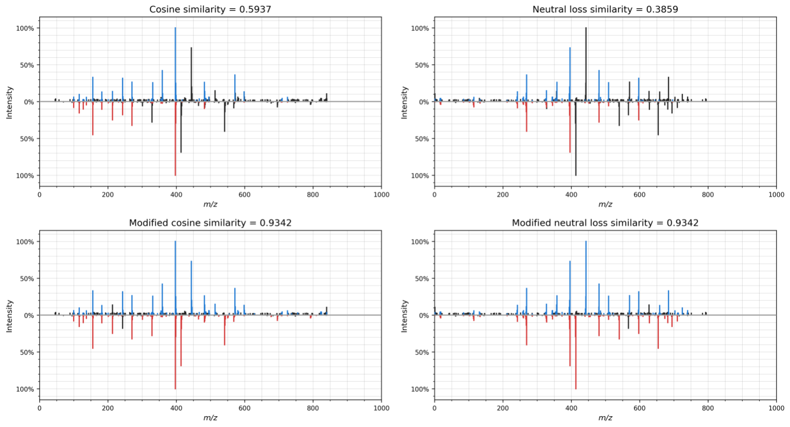

# Spectrum similarity evaluation

This repository contains code to compare several spectrum similarity scores for the discovery of related molecules.

Similarity scores that are currently implemented are:

- Cosine similarity
- Modified cosine similarity
- Neutral loss similarity
- Modified neutral loss similarity

## Usage

Code example to create mirror plots using different similarity scores:

```
import spectrum_utils.spectrum as sus

import plot


usi1 = "mzspec:GNPS:GNPS-LIBRARY:accession:CCMSLIB00000424840"
usi2 = "mzspec:MSV000086109:BD5_dil2x_BD5_01_57213:scan:760"

spectrum1 = sus.MsmsSpectrum.from_usi(usi1)
spectrum1.precursor_charge = 1
spectrum1 = spectrum1.set_mz_range(0, spectrum1.precursor_mz)
spectrum1 = spectrum1.remove_precursor_peak(0.1, "Da")

spectrum2 = sus.MsmsSpectrum.from_usi(usi2)
spectrum2.precursor_charge = 1
spectrum2 = spectrum2.set_mz_range(0, spectrum2.precursor_mz)
spectrum2 = spectrum2.remove_precursor_peak(0.1, "Da")

plot.plot_mirror(spectrum1, spectrum2, "cosine", "cosine.png")
plot.plot_mirror(
    spectrum1, spectrum2, "modified_cosine", "modified_cosine.png"
)
plot.plot_mirror(spectrum1, spectrum2, "neutral_loss", "neutral_loss.png")
plot.plot_mirror(
    spectrum1, spectrum2, "modified_neutral_loss", "modified_neutral_loss.png"
)
```



For more advanced functionality, see the source code.

## Contact

For more information you can visit the [official code website](https://github.com/bittremieux/cosine_neutral_loss) or send an email to <wbittremieux@health.ucsd.edu>.
